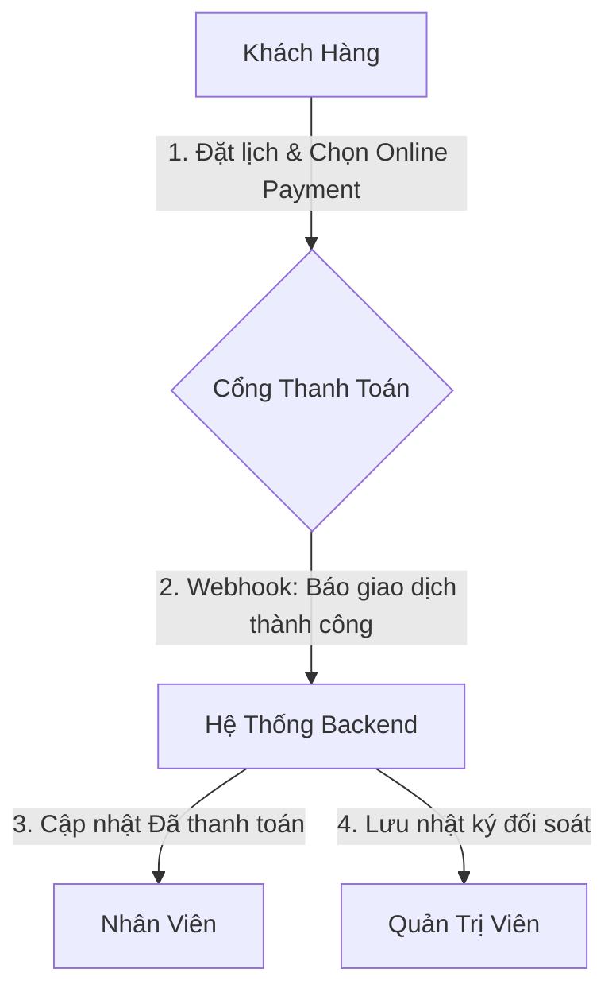

# Đề xuất thiết kế: Tích hợp Thanh toán Online vào hệ thống AutoWash Pro (Dành cho đồ án SWP391)

Tài liệu này ghi lại chi tiết thiết kế nghiệp vụ, phân vai nhiệm vụ (Role-based actions) và các giải pháp kỹ thuật đề xuất để tích hợp cổng thanh toán online vào hệ thống quản lý tiệm rửa xe AutoWash Pro.

---

## 1. Phân chia vai trò và nhiệm vụ (Role-based Management)

Để hệ thống vận hành đúng quy trình và bảo mật dòng tiền, mỗi vai trò (Role) trong hệ thống sẽ chịu trách nhiệm quản lý các đầu việc sau:



### 1.1. Vai trò: KHÁCH HÀNG (Customer)
* **Đặt lịch & Chọn hình thức:** Khách hàng được lựa chọn giữa:
  * `Thanh toán tại cửa hàng` (Tiền mặt/Chuyển khoản trực tiếp cho nhân viên).
  * `Thanh toán online` (Thẻ ATM/Mã QR/Ví điện tử qua cổng thanh toán).
* **Luồng thanh toán:**
  * Nếu chọn thanh toán online, khách được chuyển hướng tới trang thanh toán bảo mật Sandbox (VNPay/PayOS).
  * Trạng thái đơn lúc chưa thanh toán xong: `Chờ thanh toán` (Pending Payment).
  * Sau khi hoàn tất: Trạng thái tự động đổi thành `Đã thanh toán (Online)` và lịch đặt đổi thành `Đã xác nhận` (Confirmed).
* **Quản lý trên giao diện:**
  * Xem lịch sử thanh toán chi tiết kèm Mã giao dịch ngân hàng để đối chiếu.
  * Hủy lịch & yêu cầu hoàn tiền tự động trước giờ hẹn ít nhất 30 phút (khi xe chưa check-in tại cửa hàng).

### 1.2. Vai trò: NHÂN VIÊN (Staff)
* **Trách nhiệm chính:** Thực hiện kỹ thuật chuyên môn (rửa xe, kiểm tra xe, xếp khoang).
* **Quản lý trên giao diện:**
  * **Tránh thu trùng tiền:** Dashboard của Staff phải hiển thị nhãn nổi bật **`ĐÃ THANH TOÁN ONLINE`** đối với các đơn khách đã trả trước. Nhân viên giao xe cho khách mà không yêu cầu thanh toán tiền mặt.
  * **Hạn chế quyền hạn:** Staff không có quyền chỉnh sửa thông tin thanh toán hoặc thực hiện hoàn tiền (Refund) cho khách hàng (tránh gian lận cấu kết).

### 1.3. Vai trò: QUẢN TRỊ VIÊN (Admin)
* **Trách nhiệm chính:** Kiểm soát dòng tiền, xử lý lỗi giao dịch và đối soát kế toán.
* **Quản lý trên giao diện:**
  * **Đối soát giao dịch (Reconciliation):** Dashboard của Admin có bảng ghi chép toàn bộ các giao dịch online thành công: Số tiền, Thời gian, Mã giao dịch cổng thanh toán (`Transaction ID`), và Tài khoản khách hàng.
  * **Báo cáo doanh thu phân kênh:** Tách biệt báo cáo doanh thu: *Tiền mặt thu tại tiệm* vs *Tiền thu qua cổng Online* để cân đối sổ sách cuối ngày.
  * **Quản lý hoàn tiền (Refund Manager):** Nhận yêu cầu hoàn tiền khi khách hủy đơn đã thanh toán online nhưng chưa check-in vào tiệm rửa xe. Admin bấm nút phê duyệt để hệ thống gọi API hoàn tiền tự động của cổng thanh toán về ví/tài khoản khách hàng. Khóa tính năng hủy/hoàn tiền khi xe đã check-in.
  * **Cấu hình API Cổng thanh toán:** Nhập các khóa bảo mật (Merchant ID, Secret Key) của cổng VNPay/PayOS.

---

## 2. Đề xuất giải pháp kỹ thuật (Sandbox / Testing)

Để phục vụ đồ án môn học chấm điểm mà không cần pháp nhân doanh nghiệp hay tài khoản ngân hàng kinh doanh thật, có các giải pháp sau:

### Phương án 1: Tích hợp cổng PayOS (Khuyên dùng cho trải nghiệm thực tế)
PayOS là cổng thanh toán mở miễn phí hỗ trợ tạo mã **VietQR** động chuyển khoản ngân hàng.
* **Cách hoạt động:** Khi khách bấm Thanh toán online, hệ thống tạo ra một mã QR chuyển khoản có sẵn số tiền và nội dung. Khách dùng ứng dụng ngân hàng thật quét mã này $\rightarrow$ Tiền chuyển thẳng vào tài khoản cá nhân của bạn. Cổng PayOS quét tài khoản của bạn và gửi tín hiệu báo thanh toán thành công (Webhook) về Backend.
* **Ưu điểm:** Khách hàng sử dụng ứng dụng ngân hàng thật để quét mã, tạo trải nghiệm demo thực tế 100% trước hội đồng chấm thi.
* **Nhược điểm:** Yêu cầu cài đặt cấu hình Webhook nhận tín hiệu trên backend.

#### * Các bước cần chuẩn bị khi tích hợp PayOS:
1. **Tài khoản & Ngân hàng:** Đăng ký tài khoản miễn phí trên [PayOS](https://payos.vn) và liên kết với một tài khoản ngân hàng cá nhân đang hoạt động (MB, VietinBank, Vietcombank,...) để nhận tiền trực tiếp.
2. **Kênh kết nối công khai (Public URL):** Sử dụng `ngrok` hoặc `localtunnel` để tạo một HTTPS URL công khai trỏ về backend cục bộ (ví dụ: `http://localhost:5000`) nhằm nhận tín hiệu Webhook từ PayOS.
3. **Thông tin cấu hình (API Keys):** Lấy `Client ID`, `API Key`, và `Checksum Key` từ dashboard PayOS để cấu hình vào file `.env`.
4. **Database Schema:** Cập nhật bảng `Booking` hoặc `Payment` với các trường `paymentMethod` (`CASH`/`ONLINE`), `paymentStatus` (`PENDING`/`PAID`/`REFUND_PENDING`/`REFUNDED`), và `payOsOrderId`.

#### * Giải pháp xử lý Hoàn tiền (Refund) của PayOS:
Do tiền chuyển trực tiếp vào tài khoản ngân hàng cá nhân của bạn, PayOS không giữ tiền trung gian và **không hỗ trợ API tự động hoàn tiền**. Quy trình hoàn tiền sẽ được xử lý **bán tự động (Semi-Automated)**:
1. **Khách hàng yêu cầu hủy:** Trên giao diện lịch sử đặt lịch, nếu khách bấm hủy hợp lệ (ví dụ trước giờ hẹn 30 phút và chưa check-in), một Form/Modal sẽ hiển thị yêu cầu khách nhập: *Tên ngân hàng thụ hưởng*, *Số tài khoản*, và *Tên chủ tài khoản*. Trạng thái đơn đổi thành `Hủy - Chờ hoàn tiền` (`REFUND_PENDING`).
2. **Admin duyệt & thực hiện hoàn tiền:** 
   * Trên dashboard Admin, tại danh sách yêu cầu hoàn tiền, Admin bấm nút "Tạo QR Hoàn tiền". 
   * Hệ thống tự động sinh một mã **VietQR** động chứa thông tin ngân hàng của khách và số tiền cần hoàn.
   * Admin dùng app ngân hàng quét mã QR này để chuyển khoản trả lại tiền cho khách.
   * Chuyển xong, Admin bấm nút **"Xác nhận đã hoàn tiền"** để hệ thống chuyển trạng thái đơn sang `Đã hoàn tiền` (`REFUNDED`).

---

### Phương án 2: Tích hợp VNPay Sandbox (Quốc dân)
VNPay cung cấp môi trường thử nghiệm Sandbox miễn phí cho môi trường học tập.
* **Cách hoạt động:** Khách hàng được chuyển sang trang thanh toán ảo của VNPay. Bạn nhập thông tin thẻ ATM ảo do VNPay cung cấp để thanh toán thành công (tiền ảo).
* **Ưu điểm:** Rất phổ biến, giảng viên quen thuộc và quy trình tích hợp dạng chuyển hướng (Redirect URL) đơn giản, dễ cài đặt.
* **Nhược điểm:** Phải sử dụng thẻ ảo của VNPay cung cấp để test, không quét mã ngân hàng thật của người dùng được.
* **Cơ chế hoàn tiền:** VNPay hỗ trợ **API hoàn tiền tự động (vnp_Api)** trong môi trường Sandbox. Hệ thống gọi API gửi yêu cầu, VNPay tự động chuyển tiền ảo ngược lại thẻ ảo của khách mà không cần khách nhập số tài khoản ngân hàng hay Admin chuyển khoản thủ công.

---

### Phương án 3: Tích hợp Ví MoMo Sandbox (Trơn tru & Hiện đại)
MoMo cung cấp môi trường thử nghiệm Sandbox rất tốt cho các nhà phát triển.
* **Cách hoạt động:** Khách hàng quét mã QR MoMo Sandbox hoặc được chuyển hướng đến trang thanh toán giả lập của MoMo và thanh toán bằng tiền ảo trên ví MoMo test.
* **Ưu điểm:** Tài liệu lập trình (API Document) cực kỳ chi tiết, dễ tích hợp.
* **Cơ chế hoàn tiền:** MoMo hỗ trợ **API hoàn tiền tự động 100%** (`/v2/gateway/api/refund`). Khi khách hủy đơn, Backend gửi yêu cầu hoàn tiền kèm `transId`, MoMo lập tức trả tiền từ tài khoản test của cửa hàng về ví test của khách hàng chỉ sau vài giây.

---

### So sánh các phương án để lựa chọn cho Đồ án:
| Tiêu chí | Phương án 1: PayOS | Phương án 2: VNPay Sandbox | Phương án 3: MoMo Sandbox |
| :--- | :--- | :--- | :--- |
| **Thanh toán** | Quét QR ngân hàng thật (tiền thật) | Thẻ ATM/QR ảo (tiền ảo) | Ví điện tử MoMo ảo (tiền ảo) |
| **Hoàn tiền** | **Bán tự động** (Khách nhập STK $\rightarrow$ Admin quét QR trả) | **Tự động 100%** qua API | **Tự động 100%** qua API |
| **Trải nghiệm Demo** | Thực tế 100% (giao dịch thật) | Giả lập (nhập thẻ ảo) | Giả lập (dùng ví test) |
| **Độ khó viết Code** | Trung bình | Khá | Dễ |

---

## 3. Các bước triển khai mã nguồn dự kiến (Roadmap)

```
[BƯỚC 1] Cập nhật Schema Database (Thêm Transaction ID, Payment Method)
   |
[BƯỚC 2] Cài đặt Thư viện SDK Cổng thanh toán (PayOS / VNPay / MoMo) và biến môi trường (.env)
   |
[BƯỚC 3] Viết API khởi tạo Link thanh toán ở Backend (Tạo hóa đơn, Link Redirect)
   |
[BƯỚC 4] Viết API Webhook/IPN nhận kết quả thanh toán từ Cổng thanh toán để cập nhật trạng thái đơn
   |
[BƯỚC 5] Cập nhật giao diện Frontend: Thêm nút Chọn thanh toán online, hiển thị Trạng thái, nhãn cảnh báo cho Staff
   |
[BƯỚC 6] Tích hợp tính năng Hoàn tiền (Refund API tự động hoặc sinh QR Hoàn tiền bán tự động) khi hủy đặt trước hợp lệ
```
